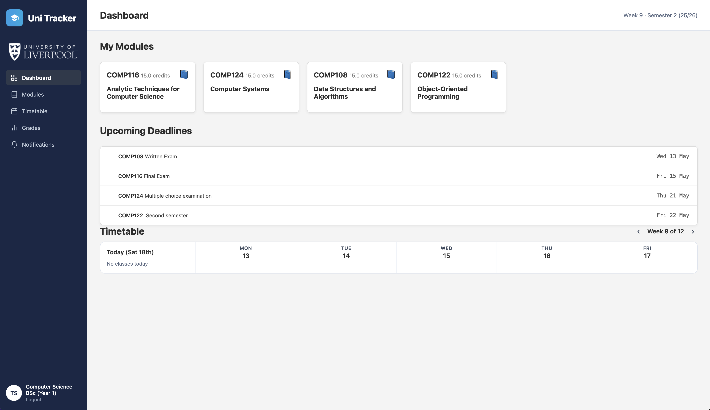
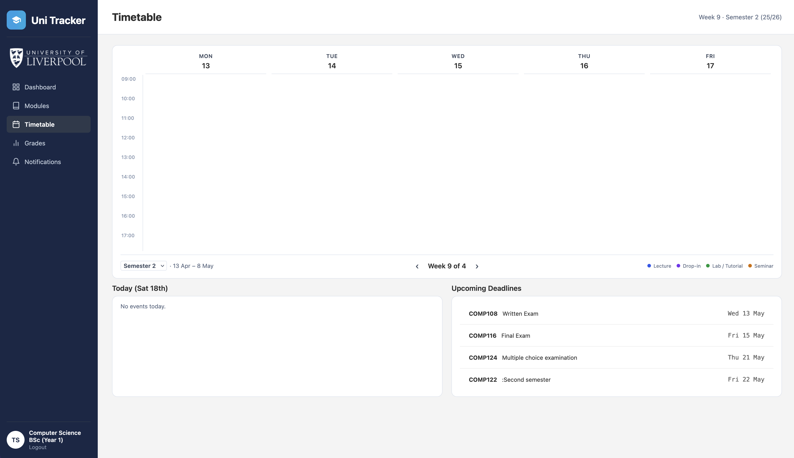
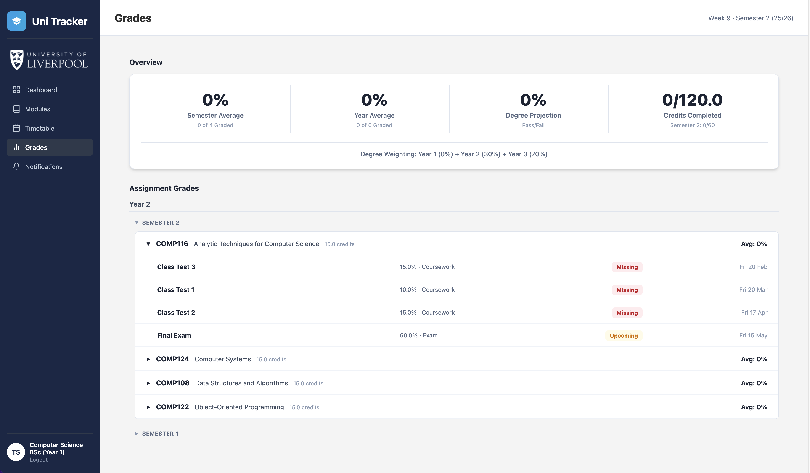
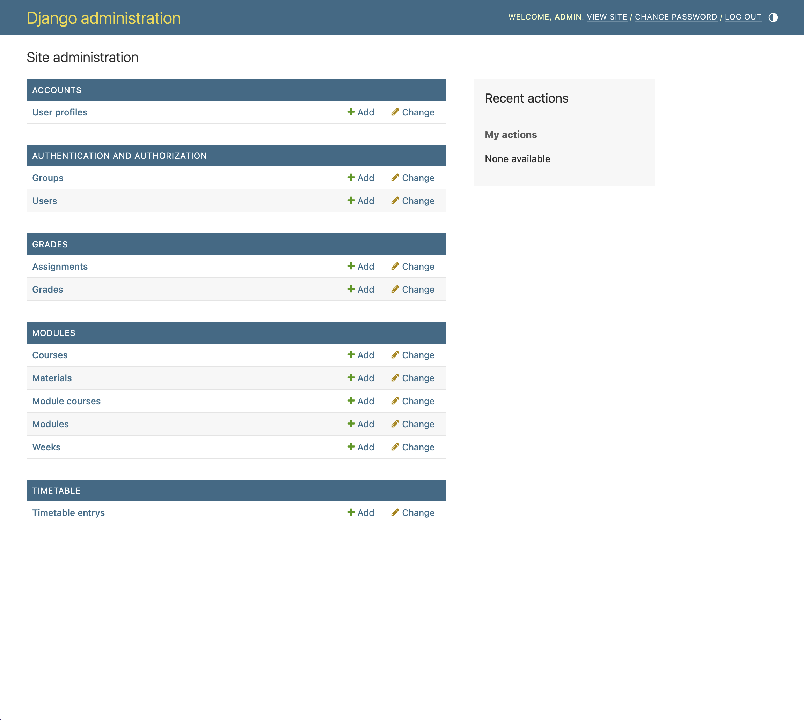

# Uni Tracker

University learning platform to replace Canvas. Django + SQLite + HTML/CSS.

COMP208 • Team 1 • 2026

---

## Live Demo

> **URL:** [https://unitracker.pythonanywhere.com/](https://unitracker.pythonanywhere.com/)
> **Test accounts:** see [`TEST_ACCOUNTS.md`](TEST_ACCOUNTS.md), or register a new account from the login page.

Hosted on PythonAnywhere (free tier). First request after idle may take ~5 seconds to wake up.

For a local run, follow Quick Setup below.

---

## Screenshots






---

## Quick Setup

**1. Clone the repo:**
```bash
git clone https://github.com/Vitto24/COMP208-Group-Project.git
cd COMP208-Group-Project
```

**2. Set up and run:**

**Mac / Linux:**
```bash
python3 -m venv env
source env/bin/activate
pip install -r requirements.txt
python manage.py migrate
python manage.py runserver
```

**Windows:**
```bash
python -m venv env
env\Scripts\activate
pip install -r requirements.txt
python manage.py migrate
python manage.py runserver
```

Open [http://127.0.0.1:8000](http://127.0.0.1:8000).

**3. Load data and generate sample content:**
```bash
python manage.py loaddata fixtures/sample_data.json
python manage.py generate_sample_data
```

The fixture loads 20 courses and 749 modules scraped from the University of Liverpool course catalogue and TULIP. `generate_sample_data` then creates assignments (with due dates from the scraped assessment data), randomised grades, and clash-free timetable entries for all enrolled students.

Register a new account to test — pick a course and year, then select your optional modules (each semester must total 60 credits). Compulsory modules are auto-enrolled.

**Admin panel** (`/admin`): create a superuser with `python manage.py createsuperuser`

---

## Feature Status

| Feature | State |
|---------|-------|
| Login / Register / Logout | ✅ done |
| Dashboard — module cards + upcoming deadlines + timetable grid | ✅ done |
| Module detail page (assignments, materials) | ✅ done |
| Grades page with averages + degree projection | ✅ done |
| Timetable page (weekly grid, semester switcher) | ✅ done |
| Settings page (Student ID, university, password change) | 🟡 in progress |
| Sample data (fixtures + `generate_sample_data`) | ✅ done |
| Lecturer / admin management | via Django `/admin` |
| Notifications | ❌ cut from scope |
| Assignment submission + marking UI | ❌ out of scope (MVP is read-only) |

MVP is read-only for students. Data is managed through Django's admin panel (`/admin`).

## Database

`python manage.py migrate` creates all tables. Don't commit `db.sqlite3`.

### UserProfile

| Field | What it stores |
|-------|----------------|
| **user** | Links to Django User (username, email, password) |
| **role** | student, lecturer, or admin |
| **university** | E.g. University of Liverpool |
| **course** | E.g. Computer Science |
| **year_of_study** | 1, 2, or 3 |

### Module

| Field | What it stores |
|-------|----------------|
| **code** | E.g. COMP202 (unique) |
| **name** | E.g. Complexity of Algorithms |
| **description** | Module description |
| **credits** | E.g. 15 or 7.5 |
| **lecturer** | E.g. Dr J. Smith |
| **semester** | 1 or 2 |
| **academic_year** | E.g. 2025/26 |
| **students** | Which students are enrolled (many-to-many) |

### Assignment

| Field | What it stores |
|-------|----------------|
| **module** | Which module this belongs to |
| **title** | E.g. Requirements Analysis |
| **weight** | Percentage, e.g. 12, 15, 30 |
| **type** | Coursework or exam |
| **due_date** | Deadline (blank if TBC) |

### Grade

| Field | What it stores |
|-------|----------------|
| **student** | Which student |
| **assignment** | Which assignment |
| **score** | Percentage mark (blank if not graded) |
| **status** | graded, submitted, or not_submitted |

### Week

| Field | What it stores |
|-------|----------------|
| **module** | Which module |
| **number** | Week number (1, 2, 3...) |
| **title** | E.g. Recurrences |

### Material

| Field | What it stores |
|-------|----------------|
| **week** | Which week this belongs to |
| **title** | E.g. Lecture Slides |
| **type** | slides, worksheet, recording, other |
| **url** | Link to the resource |
| **available** | True or false (false = 'Not yet available') |

### Relationships

```
User ——— UserProfile ——— Course
  └── enrolled in ——— Module ——— ModuleCourse (year, compulsory)
                        ├── Assignment ——— Grade (per student)
                        ├── TimetableEntry (per student)
                        └── Week ——— Material
```

A student's course determines which modules are available. ModuleCourse links modules to courses with year level and compulsory/optional status. Each semester must total 60 credits.

---

## Repo Structure

```
uni_tracker/         Project settings
accounts/            Auth — login, register, logout, user profiles, module picker
modules/             Module detail, materials, week content
grades/              Grades, assignments, averages, degree projection
dashboard/           Dashboard — module cards, deadlines, timetable grid
timetable/           Weekly timetable grid + semester switcher
settings_page/       User settings (Student ID, uni, password change)
scraper/             One-off scraper for UoL catalogue + TULIP data
templates/           Shared templates (base.html = sidebar + layout)
static/              CSS, JS, images
fixtures/            Sample data (JSON)
mockups/             Screenshots of what each page should look like
docs/                Meeting minutes + architecture diagrams
```

Each app has: `models.py` (database tables), `views.py` (logic), `urls.py` (routing), `templates/` (HTML).

---

## How to Build a Page

Each page has an empty view and an empty template. Your job is to fill them in.

### 1. Check the mockup

Look in `/mockups` for the screenshot of your page. Check the models in `models.py` to see what data is available.

### 2. Write the view

Your view already exists in `views.py` but it's empty. Add queries to get data and pass it to the template:

```python
from django.shortcuts import render
from modules.models import Module

def dashboard(request):
    modules = Module.objects.all()
    return render(request, 'dashboard/dashboard.html', {
        'modules': modules,
    })
```

### 3. Build the template

Your template already extends `base.html`. Replace the placeholder text with HTML + Django template tags:

```html

    <h3>{{ module.code }}: {{ module.name }}</h3>
    <p>{{ module.credits }} credits</p>

```

### 4. Push it

```bash
git checkout -b feature/your-page
git add .
git commit -m "dashboard page showing real data"
git push origin feature/your-page
```

Open a PR on GitHub and message the WhatsApp group.

---

## Git

Use branches. Don't commit to main directly.

```bash
git pull origin main                       # get latest
git checkout -b feature/your-task          # e.g. feature/grades-page
# ... work + commit ...
git push origin feature/your-task
```

Open a PR → message WhatsApp → someone merges it.

---

## Team & Contributions

| Member | Primary areas |
|---|---|
| Tyr Bujac | Dashboard, timetable, registration/module picker, scraper, sample data, CI, hosting |
| Samuel Garwood | Login, account setup, base architecture |
| Owen Wells | Grades page, degree projection |
| Vittorio Gastaldi | Settings page, multi-university support |
| Jamal Ahmed | Module detail page |
| Daniel Greslow | Module list page |
