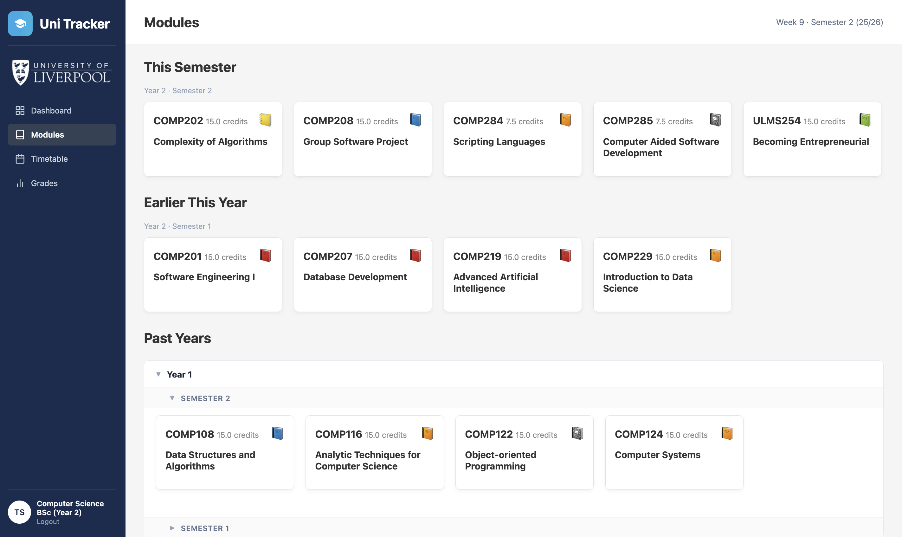
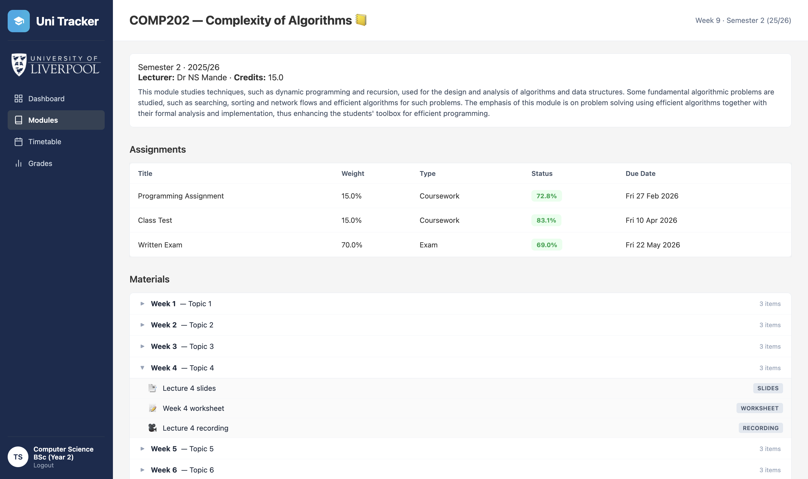

# Uni Tracker

COMP208 Group Software Development Project — Team 1, 2025/26. Built with Django, SQLite and vanilla HTML/CSS.

## What is this?

Uni Tracker is a web platform for University of Liverpool undergraduates. It pulls together the scattered parts of student life — module pages, timetables, deadlines, and grades — into a single consistent interface. It's a Canvas-style learning platform: Liverpool students currently use Canvas, which is widely regarded as inconsistent across modules, poor at surfacing deadlines, and unhelpful for tracking grade progress toward a degree classification.

The project was built by a six-person team for COMP208 Group Software Development Project, 2025/26.

**Key features:** 749 real modules scraped from the UoL catalogue + TULIP across 20 courses · credit-balanced module picker (enforces 60/60 per semester) · clash-free per-student timetables · weighted grade calculator with degree classification projection · iCal calendar export · registration gate with prior-year module backfill · 27 unit tests passing (`python manage.py test`).

---

## Screenshots

### Dashboard


### Modules



### Module Detail



### Timetable


### Grades


### Admin


---

## Live Demo

> **URL:** [https://unitracker.pythonanywhere.com/](https://unitracker.pythonanywhere.com/)
> **Test accounts:** see [`TEST_ACCOUNTS.md`](TEST_ACCOUNTS.md), or register a new account from the login page.

Hosted on PythonAnywhere (free tier). First request after idle may take ~5 seconds to wake up.

For a local run, follow Quick Setup below.

---

## Quick Setup

**1. Clone the repo:**

```bash
git clone https://github.com/Vitto24/COMP208-Group-Project.git
cd COMP208-Group-Project
```

**2. Set up and run:**

**Mac / Linux:**

```bash
python3 -m venv env
source env/bin/activate
pip install -r requirements.txt
python manage.py migrate
python manage.py runserver
```

**Windows:**

```bash
python -m venv env
env\Scripts\activate
pip install -r requirements.txt
python manage.py migrate
python manage.py runserver
```

Open [http://127.0.0.1:8000](http://127.0.0.1:8000).

**3. Load data and generate sample content:**

```bash
python manage.py loaddata fixtures/sample_data.json
python manage.py generate_sample_data
```

The fixture loads 20 courses and 749 modules scraped from the University of Liverpool course catalogue and TULIP. `generate_sample_data` then creates assignments (with due dates from the scraped assessment data), randomised grades, and clash-free timetable entries for all enrolled students.

Register a new account to test — pick a course and year, then select your optional modules (each semester must total 60 credits). Compulsory modules are auto-enrolled.

**Admin panel** (`/admin`): create a superuser with `python manage.py createsuperuser`

---

## Scope

The MVP covers registration with a role picker (Student / Lecturer / Administrator), the module picker, dashboard, modules, grades, timetable, settings, and lecturer/admin management via Django's `/admin`. Students can Submit assignments and see a Pending Grade pill; staff users grade via `/admin/` or inline on the module detail page. Out of scope: notifications, real file upload on submission, and a mobile app — these were cut to keep the MVP read-through polished rather than a half-built full platform. See the live site or the user manual for the student-facing tour.

## Database

`python manage.py migrate` creates all tables. Don't commit `db.sqlite3`.

Models live in `models.py` inside each app (`accounts`, `modules`, `grades`, `timetable`). The ER diagram is at `docs/diagrams/2-er-diagram.html`.

---

## Repo Structure

```
uni_tracker/         Project settings
accounts/            Auth — login, register, logout, user profiles, module picker
modules/             Module detail, materials, week content
grades/              Grades, assignments, averages, degree projection
dashboard/           Dashboard — module cards, deadlines, timetable grid
timetable/           Weekly timetable grid + semester switcher
settings_page/       User settings (profile, course, module selection)
scraper/             One-off scraper for UoL catalogue + TULIP data
templates/           Shared templates (base.html = sidebar + layout)
static/              CSS, JS, images
fixtures/            Sample data (JSON)
mockups/             Screenshots of what each page should look like
docs/                Meeting minutes + architecture diagrams
```

Each app has: `models.py` (database tables), `views.py` (logic), `urls.py` (routing), `templates/` (HTML).

---

## Team & Contributions


| Member            | Primary areas                                               |
| ----------------- | ----------------------------------------------------------- |
| Jamal Ahmed       | Module Pages, CSS                                           |
| Tyr Bujac         | Timetable, module picker, scraper, sample data, CI, hosting |
| Samuel Garwood    | Login, account setup, base architecture                     |
| Vittorio Gastaldi | Settings page, multi-university support                     |
| Daniel Greslow    | Module list page, dashboard                                 |
| Owen Wells        | Grades page, degree projection                              |


